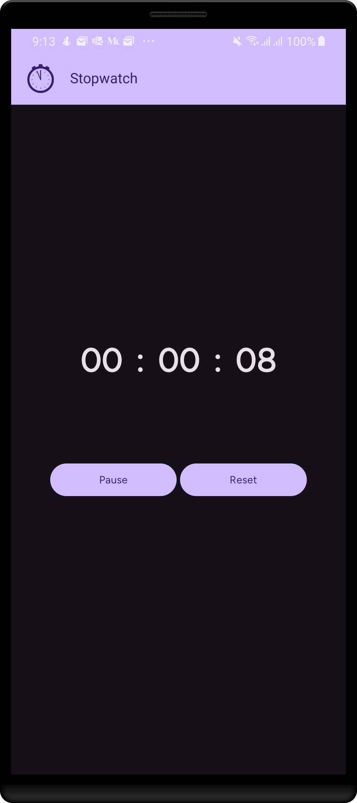

# Stopwatach

An app that measures the time elapsed between its
activation and deactivation, built as part of my Android development internship at [Oasis Infobyte](https://oasisinfobyte.com/).

## ✨ Features
- 🎨 Beautiful UI
- 🌙 Full support for night mode (dark theme)
- ⚙️ Continues counting in the background as well
- 📱 Adaptive layout

## 🛠️ Tech Stack

- App logic: Kotlin
- Frontend / UI: Jetpack Compose

## 📱 Screenshot

# ©️ Credits

| Category   | Name                    | Source       |
|------------|-------------------------|--------------|
| Typography | Vend Sans font          | [Google Fonts](https://fonts.google.com/specimen/Vend+Sans?query=vend+san) |
| Drawables  | Calculator illustration | [Pixabay](https://pixabay.com/)      |